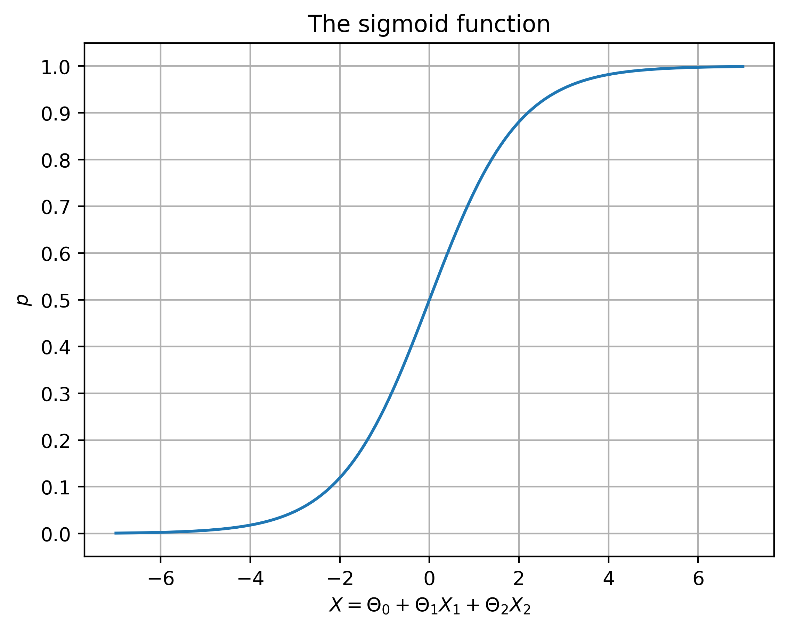
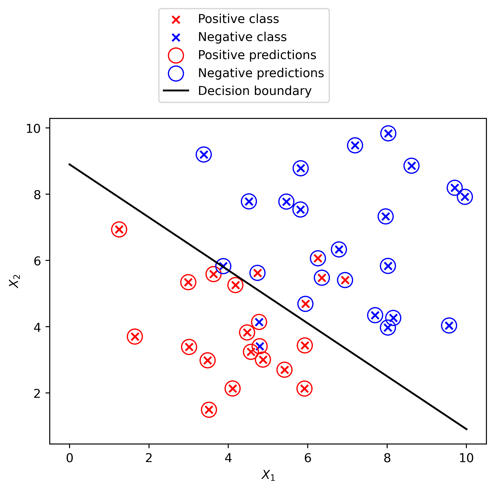

# Projeto 3 — Regressão Logística Multivariada

Regressão logística com **todas as características** do dataset, com estudo da função sigmoid e da superfície de decisão em duas dimensões.

**Fonte do projeto:** livro *Projetos de Ciência de Dados com Python* — Stephen Klosterman (Novatec Editora, 2020), Lição 3.

## Metodologia

1. **Dados:** UCI Credit Card (5.333 registros, 23 variáveis), split de treino/teste.
2. **Modelo:** `LogisticRegression` multivariado (todas as features).
3. **Análise da decisão:**
   - Função sigmoid `σ(x) = 1 / (1 + e⁻ˣ)` e sua relação com as log-odds;
   - Superfície de decisão em duas dimensões (probabilidade de inadimplência × `PAY_1` × `PAY_2`);
   - Odds de inadimplência agrupadas por valor médio de `PAY_1`.

## Resultados

- **AUC = 0.627** com todas as variáveis — ganho modesto sobre o melhor modelo univariado (0.618), típico quando as variáveis são altamente correlacionadas entre si.
- A superfície de decisão mostra claramente a região de alta probabilidade de inadimplência (pagamentos negativos recorrentes).





## Estrutura do repositório

| Caminho | Conteúdo |
|---|---|
| `regressao_logistica_multivariada.ipynb` | Notebook completo, já executado |
| `Data/` | Datasets do projeto (UCI Credit Card) |
| `img/` | Figuras extraídas do notebook |

## Como executar

```bash
pip install pandas numpy matplotlib seaborn scikit-learn xlrd
jupyter notebook regressao_logistica_multivariada.ipynb
```

## Dependências

`pandas 1.5.3`, `numpy 1.24.4`, `scikit-learn 1.3.2`, `matplotlib 3.7.5`, `seaborn 0.13.2`
